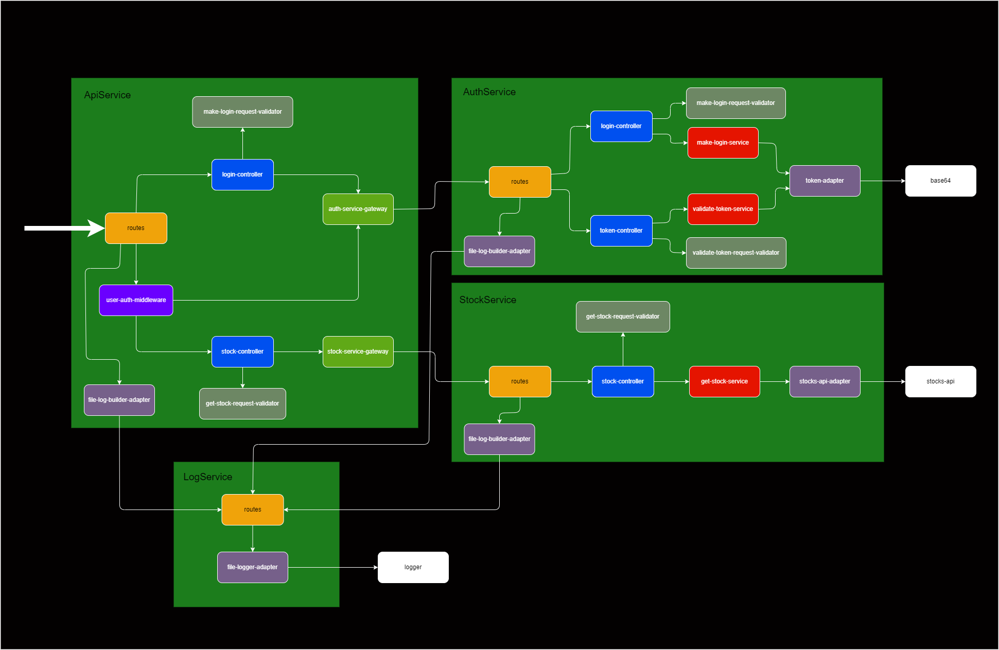

# stock-price-tracker

## Project Overview

This project demonstrates a backend split into microservices made with Python, a frontend made with TypeScript, utilizing Test-Driven Development (TDD) and Clean Architecture principles.

## Running the Project

To run the project using Docker, execute the following command:
```sh
docker compose up --build
```

## Services

### Api Service

- **Description**: Acts as the main entry point to the backend.
- **Documentation**: [http://localhost:80/docs](http://localhost:80/docs)
- **Routes**:
  - `/login`: Route to login.
  - `/stock?q={name}`: Route to get stock data by name.

### Stock Service

- **Description**: Processes and sends stock data.
- **Documentation**: [http://localhost:81/docs](http://localhost:81/docs)
- **Routes**:
  - `/stock?symbol={name}`: Route to consult the stock by name.

### Auth Service

- **Description**: Handles token generation and authentication.
- **Documentation**: [http://localhost:82/docs](http://localhost:82/docs)
- **Routes**:
  - `/login`: Route to generate a token.
  - `/validate-token`: Route to authenticate a token.

### Log Service

- **Description**: Responsible for logging information about the other services into files located in its logs directory.
- **Documentation**: [http://localhost:83/docs](http://localhost:83/docs)
- **Routes**:
  - `/log`: Route to receive the logs.

## Frontend Web

- **URL**: [http://localhost:3000](http://localhost:3000)

## Frontend Mobile

To run the frontend mobile version, enter the frontend-mobile folder and run the following commands:
```sh
npm install
npm run android
```

## Diagrams

### Backend Microservices Architecture


### Frontend Login Architecture


### Frontend Get Stock Data Architecture


## Author

Douglas Volcato  
[GitHub](https://github.com/DouglasVolcato)
